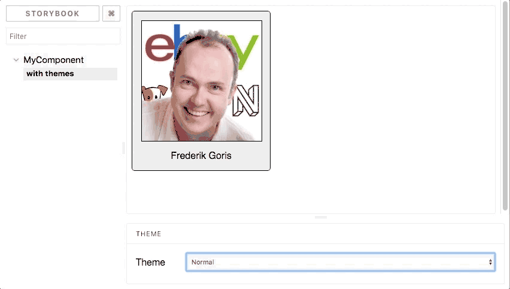

# Storybook Addon ThemePicker

This package provides a way to easily preview various themes applied to your [emotion](https://emotion.sh/)-based React
components using [Storybook](https://storybook.js.org/).



## Usage

As with all Storybook addons, first register the addon in your `addons.js` file:

```javascript 1.7
import '@ebay/storybook-addon-themepicker/register';
```

Then, simply wrap your component using the `WithThemes` component:

```javascript 1.7
import {WithThemes} from '@ebay/storybook-addon-themepicker';

storiesOf('MyComponent', module)
  .add('with themes', () => (
    <WithThemes themes={themeChoices}>
      <MyComponent />
    </WithThemes>
  ));
```

The `themes` parameter passed to `WithThemes` should be an array of objects, each containing a theme `name` and the `theme` itself:

```javascript 1.7
const defaultTheme = {
  borderColor: '#333',
  backgroundColor: '#eee',
  textColor: '#333'
};

const darkTheme = {
  borderColor: '#777',
  backgroundColor: '#333',
  textColor: '#eee'
};

const themeChoices = [
  {
    name: 'Normal',
    theme: defaultTheme
  },
  {
    name: 'Dark Mode',
    theme: darkTheme
  }
];
```

### Using TypeScript

The package exports the `ThemeDescriptor` type for use with TypeScript. The above declaration of `themeChoices` would
change to look like this in a TypeScript-based project:

```typescript
import {ThemeDescriptor} from '@ebay/storybook-addon-themepicker';

// Your theme type:
type Theme = {
  borderColor: string;
  backgroundColor: string;
  textColor: string;
};

// Your theme objects that implement your theme type:
export const defaultTheme: Theme = {
  borderColor: '#333',
  backgroundColor: '#eee',
  textColor: '#333'
};

export const darkTheme: Theme = {
  borderColor: '#777',
  backgroundColor: '#333',
  textColor: '#eee'
};

// ThemeDescriptor is parameterized by your theme type:
const themeChoices: Array<ThemeDescriptor<Theme>> = [
  {
    name: 'Normal',
    theme: defaultTheme
  },
  {
    name: 'Dark Mode',
    theme: darkTheme
  }
];
```

### Examples

The github project comes with an example project that uses `@ebay/storybook-addon-themepicker`. See the example's
[README](examples/dark-mode/README.md) for instructions on how to build and run the example project.

## Contributing

Feel free to submit pull requests against this project.

### Running the Tests

Be sure to run `tslint` on your code, and run the unit tests. To do so, simply run

```
yarn lint
yarn test
```

# License

Copyright 2018-2019 eBay Inc. <BR>
Developer/Author: Frederik Goris

Use of this source code is governed by an MIT-style license that can be found in the LICENSE file or at https://opensource.org/licenses/MIT.
